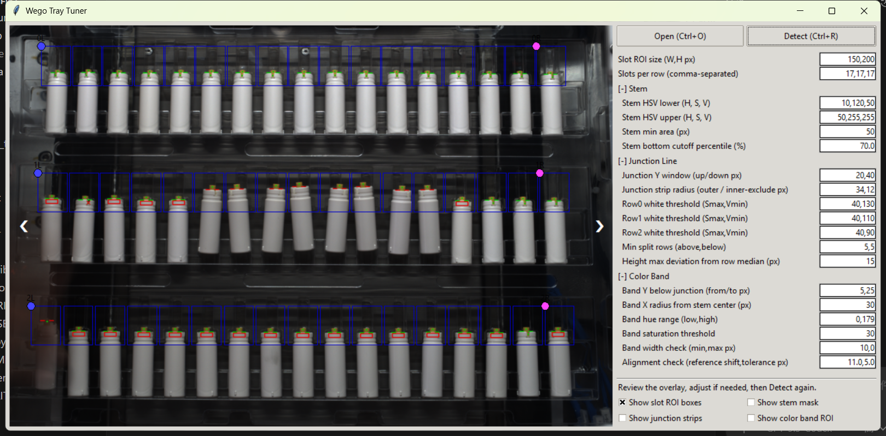

# wego-tray-tuner

Interactive tuning workspace for Wego tray inspection parameters, aligned with VisionRuntime detector logic.

wego-tray-tuner is a visual tuning tool built around detector logic synced from VisionRuntime. It focuses on parameter visibility, anchor editing, and overlay-based inspection review, so tuning can be done interactively instead of only through raw config files.

## Overview

This project is intended for single-image detector tuning and review in a practical engineering workflow. It provides:

- visual parameter adjustment
- anchor placement and correction
- overlay-based inspection result review
- local working-config saveback after successful detection

Detector algorithm logic remains in the synced files under `detect/`, while this repository provides the UI shell and tuning workflow around that logic.

## What this tool is for

wego-tray-tuner exists to make detector tuning more maintainable and reviewable.

Instead of editing inspection parameters only in YAML and re-running the full runtime, this tool lets you:

- load an image directly
- move anchors visually
- adjust parameters interactively
- run detection and inspect the returned overlay immediately
- save the current working state for continued tuning

This makes it useful as a focused tuning workspace for detector recipes that will later be used with VisionRuntime.

## Relationship to VisionRuntime

This repository is not a separate detector implementation.

Its role is:

- **UI and tuning workflow** live here
- **detector logic** is synced from VisionRuntime under `detect/`
- **detector recipes** are loaded from `config/wego_tray/`

This structure helps keep tuning behavior aligned with the runtime behavior used in the main inspection project.

## Highlights

- Interactive anchor placement for Wego tray inspection
- Visual parameter adjustment in a dedicated tuning UI
- Overlay-based inspection review after each detection run
- Neighbor-image browsing with `Prev/Next` for quick comparison
- Working-config persistence after successful tuning
- Synced detector logic for consistency with VisionRuntime

## UI Preview



The UI provides interactive anchor placement, parameter editing, and overlay-based inspection review in a single workspace.
It is designed to make detector tuning easier to validate visually before syncing recipes back into a runtime workflow.

## Sync Workflow (Manual Copy)

Manually copy from VisionRuntime:

- `VisionRuntime/config/wego_tray/*.yaml` -> `wego-tray-tuner/config/wego_tray/*.yaml`
- `VisionRuntime/detect/*` -> `wego-tray-tuner/detect/*`
- `VisionRuntime/utils/image_codec.py` -> `wego-tray-tuner/utils/image_codec.py`
- optional samples -> `wego-tray-tuner/data/images/*`

## Quick Start

```powershell
pip install -r requirements.txt
python main.py
```

## Packaging (PyInstaller onedir)

Build a folder-based package (`onedir`):

```powershell
pip install pyinstaller
pyinstaller --noconfirm --clean --windowed --name wego-tray-tuner main.py
```

After build, copy the detector recipe folder to the generated output:

- source: `config/wego_tray/*.yaml`
- target: `dist/wego-tray-tuner/config/wego_tray/*.yaml`

Run:

- `dist/wego-tray-tuner/wego-tray-tuner.exe`

Notes:

- Keep the whole `dist/wego-tray-tuner/` folder together (do not move only the exe).
- The packaged app reads/writes `config/wego_tray/=@WORKING_+.yaml`.
- The packaged app expects recipe files under `config/wego_tray/`.
- `onedir` output includes runtime dependencies under `_internal/` (OpenCV / NumPy / Tk); this is normal.

## UI Workflow

1. Click `Open` to load an image.
2. Drag 6 anchors (`0/1/2` x `L/R`) and adjust parameters.
3. Click `Detect` to run inspection and update overlay.
4. Optional: use `Prev/Next` to browse images in the same folder.

After `Detect`, the displayed image is the detector overlay returned by `detect/wego_tray.py`.

## Config Load/Save Behavior

### Load priority

1. `config/wego_tray/=@WORKING_+.yaml` (working config)
2. first lexicographically sorted recipe under `config/wego_tray/*.yaml`, excluding `_`-prefixed files and `=@WORKING_+.yaml`

### Save target after successful `Detect`

- `config/wego_tray/=@WORKING_+.yaml`

### Write behavior

- If params were not changed, no file write occurs.

## Project Layout

- `main.py`: thin application entrypoint
- `app/__init__.py`: app package export surface
- `app/controller.py`: app workflow controller
- `ui/control_panel.py`: right parameter panel
- `ui/image_view.py`: image canvas, overlays, anchors, nav hit areas
- `core/slot_layout_utils.py`: ROI grid generation helpers
- `core/params.py`: YAML load/merge/save
- `core/detector.py`: adapter to synced detector
- `detect/`: synced detector package from VisionRuntime
- `config/`: synced detector config
- `data/`: sample images

## Docs

- `docs/app_design.md`: wego-tray-tuner app design and runtime flow
- `docs/detect.md`: detector reference and compatibility constraints
- `docs/sync_contract.md`: sync contract with VisionRuntime
- `docs/ui_param_mapping.md`: UI label to detector key mapping
